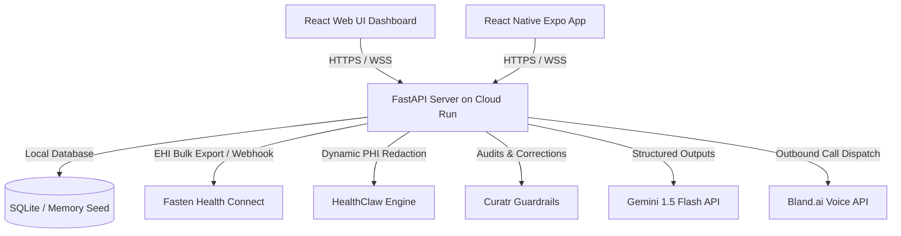

# Beluma Health - Google Hackathon One-Pager Submission

**Project Title**: Beluma Health  
**Tagline**: Next-Gen EHR Sync, HIPAA-Compliant Redaction, and Voice-Driven Care Coordination powered by Google Cloud & Gemini.  
**Submission Category**: Getting Started with Gemini 1.5 & Google Cloud Run

---

## 1. Executive Summary
**Beluma Health** is an intelligent, voice-capable clinical coordination agent and EHR viewer designed to bridge the gap between patient medical records and actionable clinical workflows. 

Managing healthcare data is notoriously complex, insecure, and siloed. Patients struggle to navigate care gaps, while clinicians waste hours auditing low-quality records or manually pre-filling specialist referrals. Beluma Health solves this by integrating **Fasten Health Connect** for patient portal ingestion, **HealthClaw's HIPAA Safe Harbor** engine for dynamic PHI redaction, **Curatr Guardrails** for clinical record quality correction, and **Robin**, a voice-enabled care coordination agent powered by **Gemini 1.5 Flash**.

---

## 2. Technical Architecture & Google Cloud Integration

The application is architected to showcase modern, cloud-native scalability and AI reasoning:

- **Stateless Cloud Deployment**: The FastAPI backend is deployed to **Google Cloud Run**, leveraging auto-scaling to zero to control infrastructure costs. It seeds its SQLite instance dynamically on container startup, ensuring instant, reproducible test environments.
- **Multimodal AI Vision & Logic**: Uses **Gemini 1.5 Flash** for two critical pathways:
  1. Parsing raw clinical documents (multimodal PDF vision scanning) and pre-populating complex specialist referral forms.
  2. Operating the logical reasoning drawer for **Robin**, showing step-by-step clinical auditing details as the agent works.
- **Unified Web & Mobile Interfaces**: Dual frontend interfaces built on **React/TypeScript** and **React Native Expo** styled with a premium slate-emerald dark design system, micro-animations, and real-time WebSocket connection state listeners.

---

## 3. Core Features & Capabilities

### 🎙️ Robin: Voice & WebSocket AI Care Coordinator
- **Interactive websocket speech dialog**: Engage with Robin via real-time speech directly in the browser with animated audio waveforms.
- **Bland.ai voice dispatcher**: Request Robin to place a physical phone call to the patient's phone to check on symptoms, coordinate specialist scheduling, or resolve care gaps.
- **Logical reasoning drawer**: Shows the agent's inner chain-of-thought, tooling invocations, and database searches.

### 🔗 Fasten Health EHR Ingestion & Webhook Synchronizer
- Integrates the Fasten Stitch web element in React Native `WebView` and web `iframe` overlays.
- Initiates Fasten's EHI bulk export API. It runs asynchronous background tasks to poll export status and utilizes a timing-safe, signature-verified webhook handler to download and parse FHIR NDJSON clinical records.

### 🛡️ HealthClaw Safe Harbor PHI Redaction
- Evaluates FHIR records on-the-fly to remove granular addresses, notes, photo objects, HTML narratives, and telecom details.
- Truncates demographic names and birth years, exposing side-by-side comparisons of raw vs. redacted records in the EHR Vault.

### 🩺 Curatr Curation Guardrails
- Scans ingested FHIR resources for clinical quality issues (e.g. deprecated ICD-9 diagnostics, incomplete records).
- Allows patients or admins to execute inline, audit-trailed ICD-10 migration corrections using a structured Provenance timeline.

### 🏃‍♂️ SmartHealthConnect & Wearables Sync
- Compiles clinical HEDIS rules to flag preventative care gaps (e.g., missing HbA1c screening for diabetes).
- Integrates Garmin/Apple Health biometrics to track resting heart rates, blood pressure logs, and step counts.

---

## 4. Why Beluma Health Wins

1. **State-of-the-Art Compliant UX**: Demystifies clinical compliance. Side-by-side PHI redaction showing the HealthClaw Safe Harbor engine in action builds immediate trust.
2. **Deep AI Integration**: Instead of wrapping simple prompt endpoints, Gemini is deeply woven into the pipeline—acting as a clinical auditor, logical reasoner, and multimodal vision form-filler.
3. **Production Readiness**: Features timing-safe signature-verified webhooks, auto-polling connection updates, sandbox fallback protection, and a production-ready Cloud Run architecture.
4. **Wow Factor**: From voice-call simulations with custom waveforms to the smooth dark HSL dashboard design, Beluma Health delivers a premium, cohesive product experience that feels ready for deployment.
