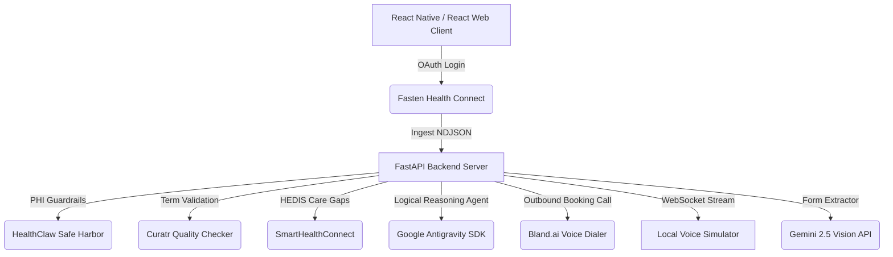

# FHIR-IQ: Autonomous Healthcare Agent & HEDIS Care Gap Closer

**FHIR-IQ** is a production-grade, patient-first health platform designed for the **GDG Stanford Hackathon**. It bridges the gap between patient-generated wearable habits, unstructured specialist forms, clinical health records (EHRs), and active scheduling workflows using autonomous AI agents.

The platform provides a dual-interface experience: a premium **React Native Expo Mobile Client** and a cloud-accessible **React Web Dashboard Dashboard** mirrored directly on the FastAPI server.

---

## 🚀 Live Cloud Deployment
- **Hosted Cloud Endpoint**: [https://healthcare-agent-backend-959144392292.us-central1.run.app](https://healthcare-agent-backend-959144392292.us-central1.run.app)
  *Visit this URL in your browser to immediately experience the fully interactive React Web UI Dashboard (mock credentials pre-seeded).*

---

## 🛠️ The Tech Stack & Architecture

FHIR-IQ orchestrates multiple state-of-the-art developer systems to achieve a fully secure, automated clinical workflow:



1. **Fasten Health Connect Integration**: Facilitates secure OAuth linkages to sandbox EHR systems (Epic, Kaiser, etc.) via an embedded WebView (mobile) or iframe (web) Stitch component, polling and parsing patient NDJSON dumps on the backend.
2. **HealthClaw Safe Harbor Redaction**: Automatically scans raw ingested FHIR resources and redacts all HIPAA-defined Protected Health Information (PHI) fields, storing compilation histories inside a local provenance timeline.
3. **Curatr Quality Check & Migration**: Automatically identifies deprecated coding systems (e.g. mapping retired ICD-9 diabetes codes) and provides inline clinical updates to modern ICD-10-CM standards with verified signature signing.
4. **SmartHealthConnect Care Gap Evaluator**: Audits patient records to generate outstanding preventive HEDIS care gaps (HbA1c tests, diabetic eye exams, blood pressure checks) and compiles Garmin/Fitbit activity statistics.
5. **Google Antigravity Agent (Robin)**: Robin is an AI assistant equipped with FHIR searching, care gap retrieval, and form mapping tools, utilizing a step-by-step logical reasoning trace.
6. **Bland.ai Outbound Voice Dialer**: Dispatches a live phone call to receptionist APIs to negotiate appointment bookings using the patient's record.
7. **WebSockets Call Simulator**: Streams live speech dialogues and statuses to the frontend with visual audio waveforms.
8. **Vision Form Auto-Filler**: Parses Specialist Referral PDFs/images via Gemini Vision and auto-populates fields using the patient's FHIR records.

---

## 📁 Repository Directory Structure

- **`backend/`**: Built on Python 3 and FastAPI
  - [main.py](file:///Users/eugenevestel/.gemini/antigravity/worktrees/app/healthcare-agent-mobile-app/backend/main.py): REST and WebSocket route definitions, webhook decoders, and middleware.
  - [agent.py](file:///Users/eugenevestel/.gemini/antigravity/worktrees/app/healthcare-agent-mobile-app/backend/agent.py): Logical reasoning engine using the `LocalAgentConfig` with custom clinical tools.
  - [database.py](file:///Users/eugenevestel/.gemini/antigravity/worktrees/app/healthcare-agent-mobile-app/backend/database.py): SQLite database schema configuration and automatic mock database seeding.
  - [index.html](file:///Users/eugenevestel/.gemini/antigravity/worktrees/app/healthcare-agent-mobile-app/backend/index.html): Full-featured interactive React web portal served on root `/`.
  - [Dockerfile](file:///Users/eugenevestel/.gemini/antigravity/worktrees/app/healthcare-agent-mobile-app/backend/Dockerfile): Multi-stage slim Python build configuration.

- **`frontend/`**: Built on Expo React Native (TypeScript)
  - `src/screens/`:demographics, Chat with Robin thought trace, EHR Vault, WebSockets/Bland.ai Call simulator, and Form Vision panels.
  - `src/services/` ([api.ts](file:///Users/eugenevestel/.gemini/antigravity/worktrees/app/healthcare-agent-mobile-app/frontend/src/services/api.ts)): Client API integrations. Includes a `USE_PRODUCTION` toggle for local-vs-cloud routing.

---

## 🚀 Quickstart Guide

### 1. Prerequisites
- Node.js (v18+)
- Python 3.11+
- Google Cloud SDK (`gcloud` CLI, optional for deploying)

### 2. Local Backend setup
```bash
cd backend
python3 -m venv venv
source venv/bin/activate
pip install -r requirements.txt
```
Copy `.env.example` (or configure a local `.env`) with active credentials:
- `FASTEN_PUBLIC_ID`, `FASTEN_PRIVATE_KEY` (Fasten Health Developer Portal)
- `GEMINI_API_KEY` (Google AI Studio)
- `BLAND_API_KEY` (Bland.ai Platform)

Start the Uvicorn dev server:
```bash
python3 -m uvicorn main:app --host 0.0.0.0 --port 8000
```
*The local database `healthcare.db` will initialize and seed mock patient data automatically on first run.*

### 3. Mobile App Client Setup
```bash
cd frontend
npm install
# Start local expo server
npx expo start
```
*Press `i` to open in iOS simulator, `a` for Android, or scan the QR code using the Expo Go mobile app.*

---

## ☁️ Cloud Deployment (Google Cloud Run)

To redeploy the FastAPI backend and web client to Google Cloud Run from source:
```bash
cd backend
gcloud run deploy healthcare-agent-backend \
  --source . \
  --region us-central1 \
  --allow-unauthenticated \
  --set-env-vars="FASTEN_PUBLIC_ID=...,FASTEN_PRIVATE_KEY=...,FASTEN_WEBHOOK_SECRET=...,GEMINI_API_KEY=...,BLAND_API_KEY=...,API_HOST=https://your-deployed-service-url.run.app"
```
*(Make sure to update `API_HOST` with the newly generated URL so that the Bland.ai webhook callback maps correctly).*
